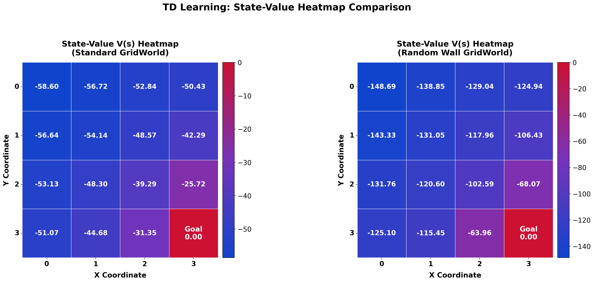
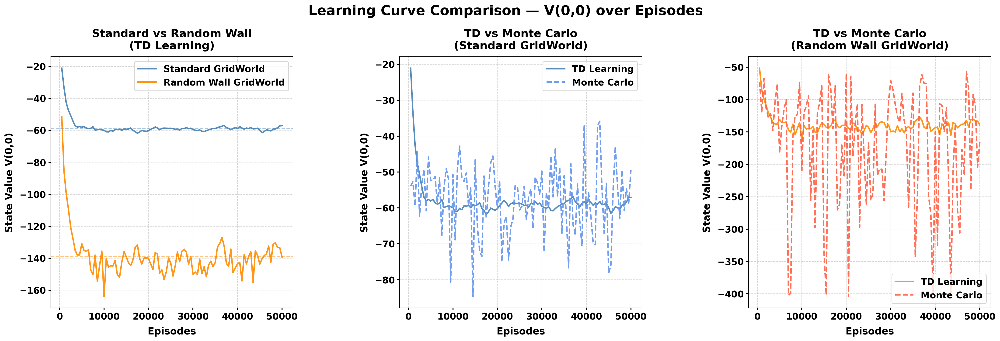

# RL Gridworld TD Learning (vs Monte Carlo Learning)

4x4 GridWorld 환경에서 TD Learning과 Monte Carlo Learning을 구현하고, 일반 환경과 무작위 벽 환경 간의 상태가치 학습 결과를 비교 분석한다.

---

## 1. 프로젝트 목적

본 프로젝트는 강화학습의 대표적 알고리즘인 시간차 학습(Temporal Difference Learning)과 몬테카를로 학습(Monte Carlo Learning)을 동일 환경에서 구현하고, 두 가지 환경 조건(일반 환경 / 무작위 벽 환경)에서 학습된 상태가치 함수 V(s)의 수렴 특성을 정량적으로 비교한다.

---

## 2. 환경 구성

### 2.1 공통 설정

| 항목 | 설정값 |
|---|---|
| 격자 크기 | 4 x 4 |
| 시작 상태 | (0, 0) — 좌상단 |
| 목표 상태 | (3, 3) — 우하단 |
| 행동 공간 | 상, 하, 좌, 우 (4방향) |
| 정책 | 균등 무작위 정책 (각 25%) |
| 보상 | 매 스텝 −1 (목표 도달 시 에피소드 종료) |
| 경계 및 벽 충돌 | 이전 위치 유지 (−1 보상은 계속 누적) |

### 2.2 Standard GridWorld

장애물이 없는 기본 4x4 격자 환경이다. 에이전트는 경계 조건만 고려하여 자유롭게 이동할 수 있다.

### 2.3 Random Wall GridWorld

매 에피소드 시작 시 2개 또는 3개의 벽이 격자 내 무작위 위치에 생성된다. 시작 지점 (0, 0)과 목표 지점 (3, 3)에는 벽이 생성되지 않으며, 같은 위치에 중복 생성되지 않는다. 벽의 위치는 에피소드마다 독립적으로 재결정된다.

---

## 3. 알고리즘

### 3.1 TD(0) Learning

에피소드 종료를 기다리지 않고, 매 스텝 이동 직후 다음 상태의 가치 추정치를 이용하여 현재 상태의 가치를 즉시 갱신한다.

```
V(s) <- V(s) + alpha * [R + gamma * V(s') - V(s)]
```

- `alpha` : 학습률 (Learning Rate)
- `R` : 현재 스텝에서 받은 보상
- `gamma` : 할인율 (Discount Factor)
- `V(s')` : 다음 상태의 현재 가치 추정치

### 3.2 Monte Carlo Learning

에피소드가 완전히 종료된 후, 해당 에피소드의 전체 누적 보상 G를 역방향으로 계산하여 방문한 모든 상태의 가치를 일괄 갱신한다.

```
V(s) <- V(s) + alpha * [G - V(s)]
```

- `G` : 에피소드 종료 시점부터 역방향으로 계산한 누적 할인 보상

### 3.3 하이퍼파라미터

하이퍼파라미터(Hyperparameter)는 학습 시작 전 사용자가 직접 설정하는 값으로, 알고리즘의 학습 속도와 수렴 특성에 직접적인 영향을 미친다.

| 파라미터 | 값 | 설명 |
|---|---|---|
| 에피소드 수 | 50,000 | 총 학습 반복 횟수 |
| 학습률 alpha | 0.01 | 업데이트 보폭. 값이 작을수록 안정적이나 수렴이 느림 |
| 할인율 gamma | 1.0 | 미래 보상 반영 비율. 1.0은 미래 보상을 현재와 동일하게 취급 |
| 기록 간격 | 500 에피소드 | V(0,0) 추적 주기 |
| 최대 스텝 (TD) | 에피소드당 1,000 | 무한 루프 방지 상한 |
| 최대 스텝 (MC) | 에피소드당 500 | 무한 루프 방지 상한 (MC는 전체 이력을 메모리에 보관하므로 더 짧게 설정) |

---

## 4. 실험 결과

### 4.1 상태가치 히트맵 비교

TD Learning으로 학습된 V(s) 테이블을 히트맵으로 시각화하여 두 환경을 비교한다. 색상은 파랑(가장 낮은 가치) → 붉은색(목표 = 0)으로 연속 전환된다.



**그래프 설명**

- 히트맵의 색상 기울기는 에이전트가 각 위치에서 목표 지점까지 도달하는 데 기대되는 누적 페널티를 나타낸다.
- 할인율 gamma = 1.0 조건에서 V(s)의 절댓값은 해당 상태에서 출발할 때 목표까지 소요되는 기대 스텝 수와 수치적으로 동일하다.
- 두 히트맵 모두 좌상단(시작점)에서 우하단(목표점)으로 갈수록 값이 증가(덜 부정적)하는 공통 패턴을 보인다. 이는 목표에 가까운 상태일수록 더 적은 스텝으로 도달할 수 있음을 반영한다.

두 환경의 수치를 직접 비교하면 아래와 같다.

| 상태 위치 | Standard TD | Random Wall TD | 차이 |
|---|---|---|---|
| V(0,0) — 시작점 (좌상단) | -59.43 | -145.66 | -86.22 |
| V(3,0) — 우상단 | -51.52 | -121.63 | -70.12 |
| V(0,3) — 좌하단 | -51.69 | -123.86 | -72.16 |
| V(2,2) — 목표 인접 | -41.91 | -104.33 | -62.42 |
| V(3,3) — 목표점 | 0.00 | 0.00 | 0.00 |

무작위 벽 환경의 V(0,0)은 일반 환경 대비 약 2.45배 더 큰 음수로 수렴하였다. 이 차이는 단순히 벽의 존재 여부가 아니라, 아래 세 가지 복합적 원인에 의해 발생한다.

1. **불필요한 스텝 누적**

- 에이전트가 벽 방향으로 이동을 시도하면 위치는 유지되지만 −1 보상이 계속 누적된다.
- 이동이 발생하지 않은 스텝에서도 페널티가 부과되므로, 벽이 많을수록 유효 이동 대비 보상 손실이 기하급수적으로 증가한다.

2. **최단 경로 차단**

- 에피소드마다 새롭게 배치되는 벽이 기존의 최단 경로를 막을 경우, 에이전트는 매 에피소드마다 우회로를 다시 탐색해야 한다.
- 무작위 정책 하에서 우회로 탐색은 추가 스텝을 대량으로 소모하며, 이것이 모든 상태의 기대 스텝 수를 증가시킨다.

3. **갇힘(Trapped) 현상**

- 드물지만 에이전트 주변 이동 가능 방향이 벽과 경계로 모두 막히는 경우가 발생한다.
- 이 에피소드에서는 최대 스텝(1,000회) 제한에 도달할 때까지 탈출이 불가능하며, 해당 에피소드에서 누적된 매우 큰 음수 보상이 전체 V(s) 추정치를 아래로 끌어내린다.

---

### 4.2 학습 곡선 비교

시작 지점 V(0,0)의 에피소드별 수렴 과정을 세 가지 관점으로 비교한다. 점선은 마지막 20개 기록값의 평균으로 계산한 수렴 추정값을 나타낸다.



**그래프 1 (좌측) — Standard vs Random Wall (TD Learning 기준)**

- 두 환경 모두 초기 에피소드에서 빠르게 하강하다가 이후 점진적으로 수렴하는 공통 형태를 보인다. 그러나 수렴하는 절댓값 수준에서 뚜렷한 차이가 나타난다.
- Standard GridWorld(파란색)는 약 −60 근방으로 수렴하는 반면, Random Wall GridWorld(주황색)는 약 −145 근방으로 수렴한다. 이 수치 격차는 무작위 벽 환경에서 에이전트가 평균적으로 2.45배 많은 스텝을 소모함을 직접적으로 반영한다.
- 수렴 후에도 Random Wall 곡선의 진폭이 더 큰 이유는, 에피소드마다 벽의 배치가 달라짐에 따라 동일 상태의 기대 스텝 수가 에피소드별로 크게 변동하기 때문이다.

**그래프 2 (중앙) — TD vs Monte Carlo (Standard GridWorld)**

- 장애물이 없는 일반 환경에서는 TD Learning(실선)과 Monte Carlo(점선)의 수렴 경로가 매우 유사하다.
- 두 알고리즘 모두 동일한 수렴값 부근에 도달하며, 편차 없이 안정적인 형태를 보인다. 이는 Standard GridWorld의 에피소드 길이 변동이 상대적으로 작기 때문이다. 에피소드가 짧고 일관될수록 Monte Carlo의 분산 문제가 억제되어 TD와 유사한 수렴 거동을 나타낸다.

**그래프 3 (우측)— TD vs Monte Carlo (Random Wall GridWorld)**

- 무작위 벽 환경에서는 두 알고리즘의 거동 차이가 명확히 드러난다.
- TD Learning(실선)은 비교적 안정적인 하강 궤적을 보이며 수렴하는 반면, Monte Carlo(점선)는 수렴 과정에서 진폭이 더 크고 불규칙한 변동을 보인다. 이 차이의 원인은 업데이트 방식의 근본적인 차이에 있다. Monte Carlo는 에피소드 종료 후 해당 에피소드의 전체 누적 보상 G를 한 번에 적용하기 때문에, 에피소드 길이가 수백 스텝에 달하는 긴 에피소드와 짧은 에피소드 사이의 G 값 차이가 매우 크다. 이 높은 분산이 업데이트의 진폭을 확대시킨다.
- 반면 TD Learning은 매 스텝 직후 다음 상태의 추정치를 이용하여 소폭씩 갱신하므로, 단일 에피소드의 길이가 업데이트 크기에 미치는 영향이 억제된다. 결과적으로 무작위 벽과 같이 에피소드 길이 변동이 큰 환경일수록 TD Learning이 Monte Carlo 대비 더 안정적인 수렴을 보임을 확인할 수 있다.

---

## 5. 파일 구조

```
RL_Gridworld_TD-learning/
│
├── doit.ipynb                   # 전체 구현 및 실험 Jupyter Notebook
│
└── Results/                     # 코드 실행 시 자동 생성되는 결과 폴더
    ├── learning_history.csv         # 에피소드별 V(0,0) 학습 이력 (4가지 조합)
    ├── heatmap_standard.png         # Standard GridWorld V(s) 히트맵
    ├── heatmap_random_wall.png      # Random Wall GridWorld V(s) 히트맵
    ├── heatmap_comparison.png       # 두 환경 히트맵 비교 (나란히)
    └── learning_curves.png          # 학습 곡선 비교 (3개 그래프)
```

`doit.ipynb` 내 셀 구성:

| 셀 | 내용 |
|---|---|
| 셀 1 | 라이브러리 임포트, GridWorld 클래스 정의 (Standard / RandomWall), Agent 클래스 |
| 셀 2 | `train_td()` / `train_mc()` 함수 정의 및 4가지 조합 학습 실행, CSV 저장 |
| 셀 3 | V(s) 히트맵 시각화 (개별 2장 + 비교 1장) |
| 셀 4 | 학습 곡선 시각화 (3개 그래프) |
| 셀 5 | 수치 비교표 및 결과 분석 출력 |

---

## 6. 실행 방법

### 6.1 의존 라이브러리 설치

```bash
pip install numpy pandas matplotlib seaborn tqdm
```

### 6.2 실행

- Jupyter Notebook 또는 VS Code 환경에서 `doit.ipynb`를 열고, 셀을 순서대로 실행한다.
- 학습 완료 후 모든 결과 이미지와 CSV 파일이 `Results/` 폴더에 저장된다.

### 6.3 실행 시간 참고

- 50,000 에피소드 기준, 4가지 조합 전체 학습 소요 시간은 CPU 환경에서 약 10초 내외이다.

---

## 저작권 ✍️

본 저장소에 포함된 코드(`doit.ipynb`) 및 모든 출력 이미지 결과물은 저작권법에 의해 보호됩니다.

저작권자의 명시적 허가 없이 본 자료의 전부 또는 일부를 복제, 배포, 수정, 상업적으로 이용하는 행위를 금합니다.

© 2026. All rights reserved.  
Contact : sjowun@gmail.com

---
